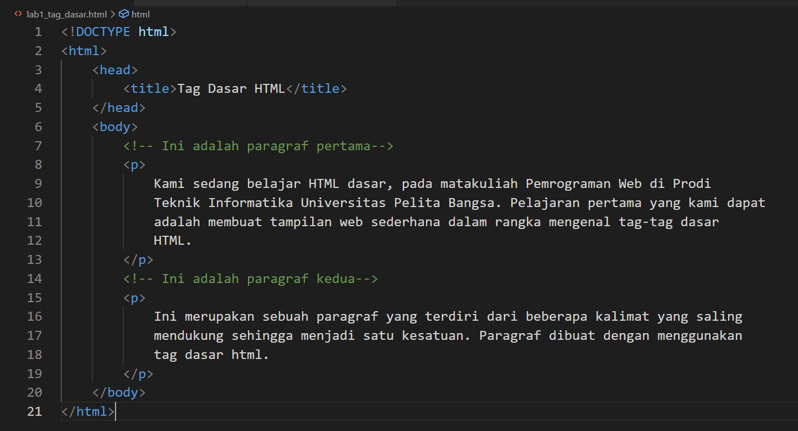
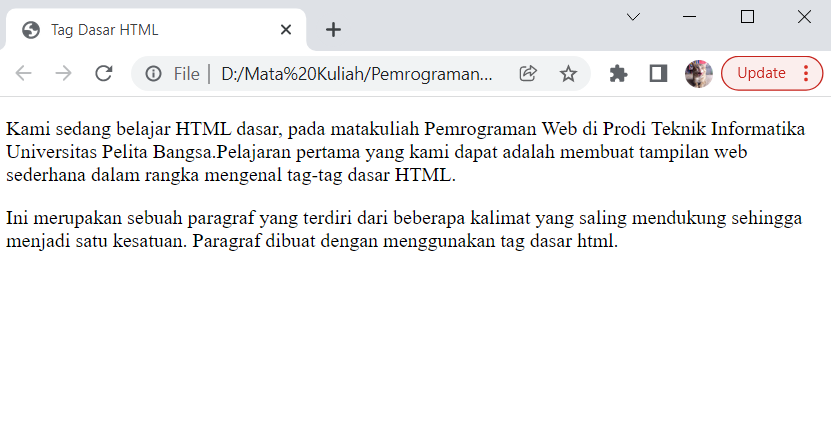

# Latihan menggunakan tag HTML  

* Nama          : Hizbullah Ridwan
* NIM           : 312110055
* Kelas         : TI.21.B.1
* Mata Kuliah   : Pemrograman Web

Dalam latihan menggunakan tag HTML ini, saya menggunakan [Google Chrome](https://www.google.com/intl/id_id/chrome/) sebagai teks editornya.  

## Tag Dasar

Hal pertama yang harus dilakukan adalah membuat sebuah file baru dengan tipenya adalah HTML.            
Kemudian untuk membuat tag dasar contohnya adalah seperti ini :            

      

Setelah itu, buka file HTML tersebut di web browser. Bisa dengan menggunakan [Google Chrome](https://www.google.com/intl/id_id/chrome/), [Mozilla Firefox](https://www.mozilla.org/id/firefox/), [Opera](https://www.opera.com/), dan lainnya.          

                 

Halaman web masih terlihat kosong karena belum diisi tag apapun pada bagian `<body>`. Hanya terlihat title nya         
saja yang sudah diberi nama *Tag dasar HTML*.       

## Membuat Paragraf

Tag paragraf berfungsi untuk menambahkan teks atau paragraf di halaman website. Tag paragraf diawali           
dengan `<p>` dan diakhir harus ditutup dengan tag `</p>`. Seperti ini :        

                 

Kemudian refresh web browser yang tadi sudah membuka file HTML supaya perubahannya terlihat.            

             

Setiap paragraf bisa diatur posisinya seperti rata kiri, kanan, maupun tengah.      
Caranya adalah dengan menambahkan atribut pada tag paragrafnya. Seperti ini :        

             

Value pada atribut `align` juga bisa diubah menjadi `justify`, `right`, dan lainnya.         
Jangan lupa refresh untuk melihat hasilnya di web browser.          

             

## Menambahkan Judul

Menambahkan judul atau biasa disebut header teks bisa dilakukan dengan menambahkan tag `h` pada html.          
Ukuran header teks pada HTML bisa disesuaikan, ada header dengan ukuran 1 yang paling besar dan         
header ukuran 6 untuk ukuran teks yang paling kecil.           

```bash
<h1>header teks ukuran 1</h1>
<h2>header teks ukuran 2</h2>
<h3>header teks ukuran 3</h3>
<h4>header teks ukuran 4</h4>
<h5>header teks ukuran 5</h5>
<h6>header teks ukuran 6</h6>
 ```      

              

 Hasilnya akan seperti ini :              

              

 ## Memformat Teks

 Mengubah format pada teks disuatu paragraf menjadi italic, bold, underline, dan sebagainya bisa              
 dilakukan pada HTML.       
 Tag `<i>` digunakan untuk mengubah format teks menjadi miring.              
 Tag `<b>` digunakan untuk mengubah format teks menjadi tebal.          
 Tag `<u>` digunakan untuk mengubah format teks menjadi garis bawah.            
 Tag `<mark>` digunakan untuk mengubah format teks menjadi highlight/marking.        
 Tag `<sup>` digunakan untuk mengubah format teks menjadi superscript.         
 Tag `<sub>` digunakan untuk mengubah format teks menjadi subscript.              
 Tag `<del>` digunakan untuk mengubah format teks menjadi garis tengah.        

 Tag-tag tersebut bisa langsung disisipkan kedalam paragraf. Contohnya ini :        

              